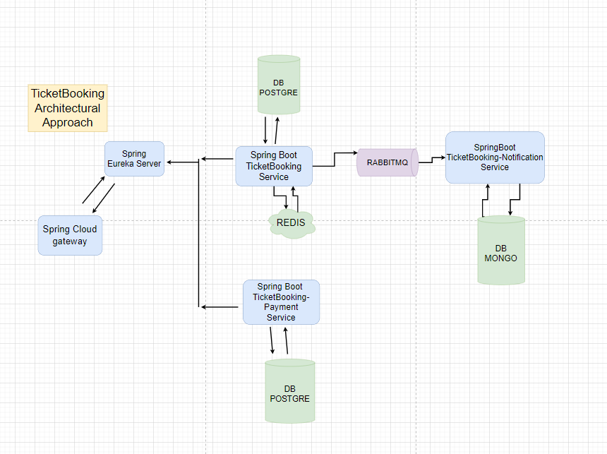
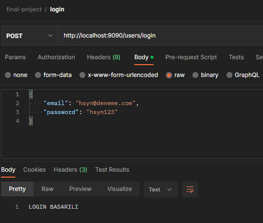
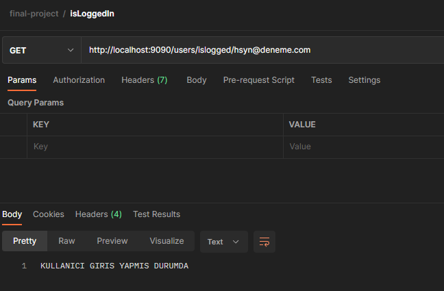
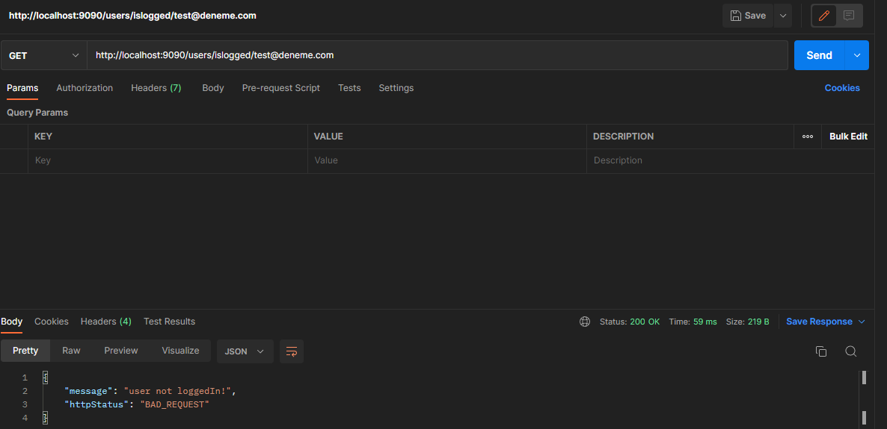
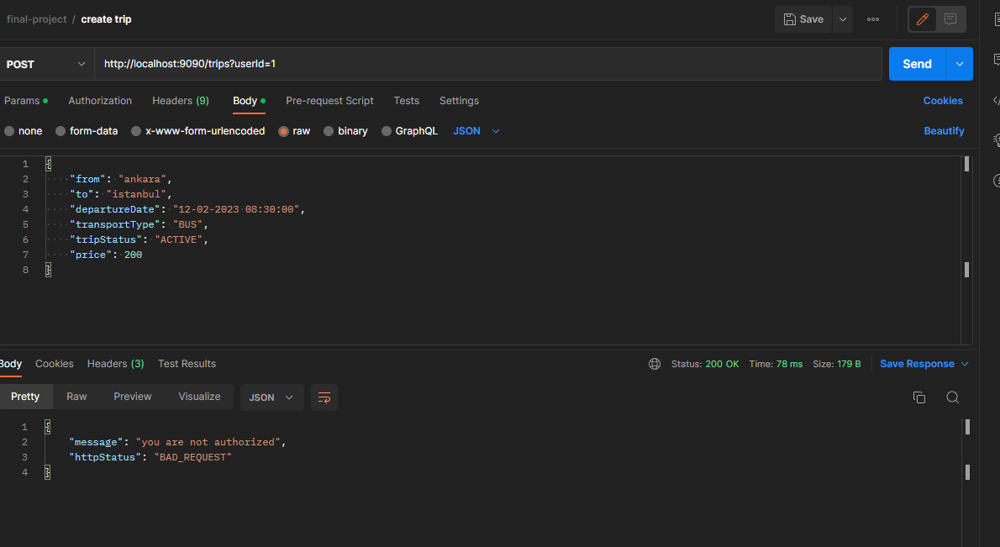

<!-- ABOUT THE PROJECT -->
## TicketBooking Project

<h4>PROJE DIAGRAM </h4>

   

## Proje Konusu:
Online uçak ve otobüs bileti satışı yapılmak istenmektedir. Uygulamanın gereksinimleri 
aşağıdaki gibidir. 

## Gereksinimler;
• Kullanıcılar sisteme kayıt ve login olabilmelidir.   
• Kullanıcı kayıt işleminden sonra mail gönderilmelidir.   
• Kullanıcı şifresi istediğiniz bir hashing algoritmasıyla database kaydedilmelidir.  
• Admin kullanıcı yeni sefer ekleyebilir, iptal edebilir, toplam bilet satışını, bu satıştan  
elde edilen toplam ücreti görebilir.  
• Kullanıcılar şehir bilgisi, taşıt türü(uçak & otobüs) veya tarih bilgisi ile tüm seferleri 
arayabilmelidir.  
• Bireysel kullanıcı aynı sefer için en fazla 5 bilet alabilir.  
• Bireysel kullanıcı tek bir siparişte en fazla 2 erkek yolcu için bilet alabilir.  
• Kurumsal kullanıcı aynı sefer için en fazla 20 bilet alabilir.  
• Satın alma işlemi başarılı ise işlem tamamlanmalı ve asenkron olarak bilet detayları 
kullanıcının telefona numarasına sms gönderilmeli.  
• SMS, mail ve push Notification gönderme işlemleri için sadece Database kayıt etme 
işlemi yapılması yeterlidir. Fakat bu işlemler tek bir Servis(uygulama) üzerinden ve 
polimorfik davranış ile yapılmalıdır.   
• Kullancılar aldığı biletleri görebilmelidir.   

## Sistem Kabulleri;  
1.Kullanıcılar bireysel ve kurumsal olabilir.
2.SMS, Mail ve Push Notification gönderim işlemleri Asenkron olmalıdır. 
3.Uçak yolcu kapasitesi: 189 
4.Otobüs yolcu kapasitesi: 45 
5.Ödeme şekli sadece Kredi kartı ve Havale / EFT olabilir. 
6.Ödeme Servisi işlemleri Senkron olmalıdır. 

<!-- TECHNOLOGIES -->
### Kullanılan Teknolojiler    
 &nbsp;
 &nbsp;
  &nbsp;
  &nbsp;
  &nbsp;
  &nbsp;
   &nbsp;
  &nbsp;

<!-- Postman Query-->
### Postman Üzerinden Atılan İsteklere Örnekler;    
  
<h4>Create User </h4>

<h4>Get All User </h4>

<h4>Login</h4>

<h4>User is Logged In</h4>

<h4>Is logged In when user not logged in (throw Exception)</h4>

<h4>Create Trip with Admin </h4>

<h4>Create Trip with Indivual User </h4>

<h4>Update Trip Status </h4>

<h4>Buy Ticket for 3 Male Passenger with Indivual User</h4>

<h4>Buy Ticket for 2 Male Passenger with Indivual User</h4>

<h4>Buy Ticket for 22 Passenger with Corparete User</h4>

<h4>Buy Ticket for 20 Passenger with Corparete User</h4>

<h4>Search Trip by transportType , from an to city</h4>

<h4>Search Trip by date</h4>

<!-- LICENSE -->
## License

Distributed under the MIT License. See `LICENSE.txt` for more information.

<!-- CONTACT -->
## Contact

### Hüseyin Karaman

  
  
<!-- PROJECT-BOOTCAMP-PRACTICUM PART -->
 

## Java Bootcamp - Kodluyoruz & Solmaz

  

<h3 align="center">Company: Solmaz Customs Consultancy/Brokerage Co.</h3>

  
<h3 align="center">Organizer: Kodluyoruz.org</h3>

